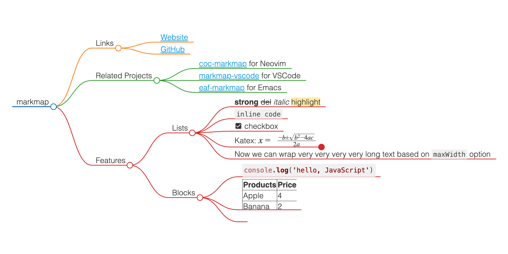

# MarkMap for GPT
This is a [markmap] rendering service for ChatGPT and other AI agent tools . 

It can render markdown mindmap to svg / png and interactive html, just similar service as [PlantUML web server](https://www.plantuml.com/plantuml/uml/SyfFKj2rKt3CoKnELR1Io4ZDoSa70000),


## APIs
The service provides rendering in 3 formats: 
1. **interactive HTML**: https://m3-swart.vercel.app/api/html/`{hash(map)}`
2. **svg**: https://m3-swart.vercel.app/api/svg/`{hash(map)}`
3. **png**: https://m3-swart.vercel.app/api/png/`{hash(map)}`

### Render API
* [Swagger UI](https://m3-swart.vercel.app/swagger)
* [OpenAPI Spec](https://m3-swart.vercel.app/swagger.json)

## Development

First, run the development server:

```bash
npm run dev
```

Open [http://localhost:3000](http://localhost:3000) with your browser to see the result.

You can start editing the page by modifying `app/page.tsx`. The page auto-updates as you edit the file.

This project uses [`next/font`](https://nextjs.org/docs/basic-features/font-optimization) to automatically optimize and load Inter, a custom Google Font.



  
* [Interactive HTML](public/sample.html)

## Online Demo
https://m3-swart.vercel.app/{format}/`{hash(map)}`?width=xx&height=xx