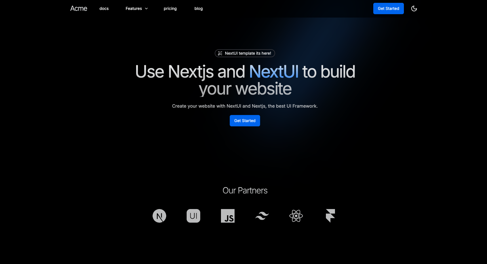

# Development

## References

* [Mastering Next.js: The Ultimate Guide to Structuring Large-Scale Projects in 2024](https://dev.to/vyan/mastering-nextjs-the-ultimate-guide-to-structuring-large-scale-projects-in-2024-h4e?utm_source=pocket_shared)
* [theodorusclarence / ts-nextjs-tailwind-starter](https://github.com/theodorusclarence/ts-nextjs-tailwind-starter)
    > 🔋 Next.js + Tailwind CSS + TypeScript starter and boilerplate packed with useful development features
* [gonzalochale / nextui-saas-landing-template](https://github.com/gonzalochale/nextui-saas-landing-template)
    > Starter template for SaaS applications landing page using Next.js 14, NextUI v2, and Tailwind CSS. See [nextui-saas-template.vercel.app](https://nextui-saas-template.vercel.app)
    

* [ixartz / Next-js-Boilerplate](https://github.com/ixartz/Next-js-Boilerplate)
    > About
    🚀🎉📚 Boilerplate and Starter for Next.js 14+ with App Router and Page Router support, Tailwind CSS 3.4 and TypeScript ⚡️ Made with developer experience first: Next.js + TypeScript + ESLint + Prettier + Husky + Lint-Staged + Jest + Testing Library + Cypress + Storybook + Commitlint + VSCode + Netlify + PostCSS + Tailwind CSS.     [nextjs-boilerplate.com](https://nextjs-boilerplate.com)
    

